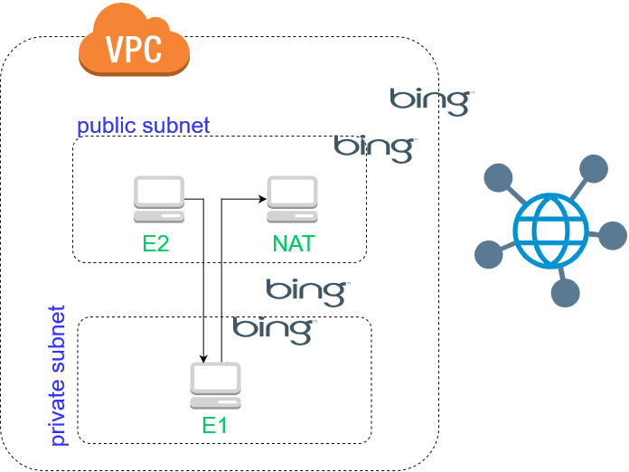

# aWS_NAT_instance
Connecting to an EC2 in a private subnet and pinging around internet from this instance (no use of VPN)

 Based on https://docs.aws.amazon.com/vpc/latest/userguide/VPC_NAT_Instance.html#NATSG

## Aim of the tutorial
	
 One wants to create an instance EC2 in an private subnet, called E1, which can be accessed only by another instance, called E2, in a public subnet of the same VPC. This tutorial aims at pinging internet from E1 with help of a NAT instance that is located in the public subnet and plays a role as an outbound/inbound bridge of E1 with the internet. To this end, we need to:
  - Create a VPC
  - Create 2 subnets : one is public (S1), one is private (S2) 
  - Create 3 instances : jump_box (E1), NAT_instance located in S1 and final_instance (E2) located in S2
  - Implement two route tables: one connected to the internet gateway (for public subnet), one connected to the NAT instance (for private subnet)
  - Define security groups corresponding to 3 instances 
## Step 1: Configuration of subnets and EC2 Instance

- For subnets:
	- "Public_Jump_box" subnet is associated with the Route table "Costume for Public"
	- "Private_Final_instance" subnet is associated with the Route table "Main for private"
	- The Route tables are defined as follows:
	
	!

