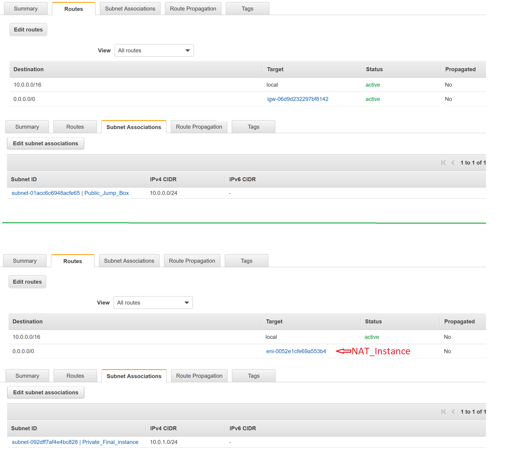
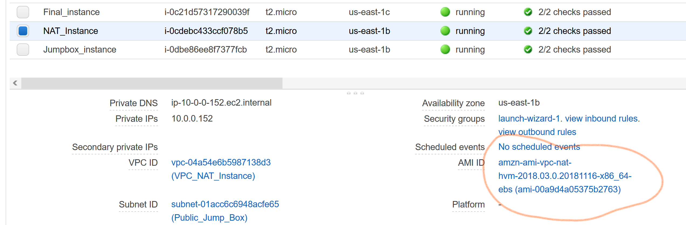
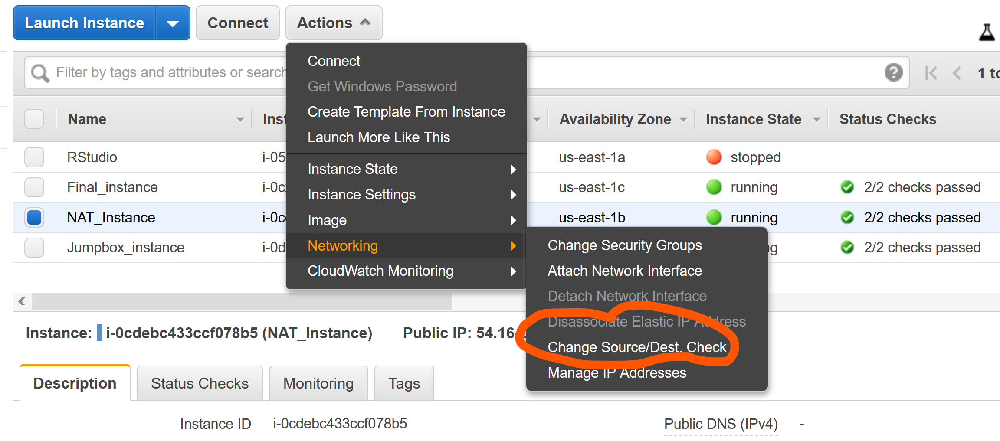
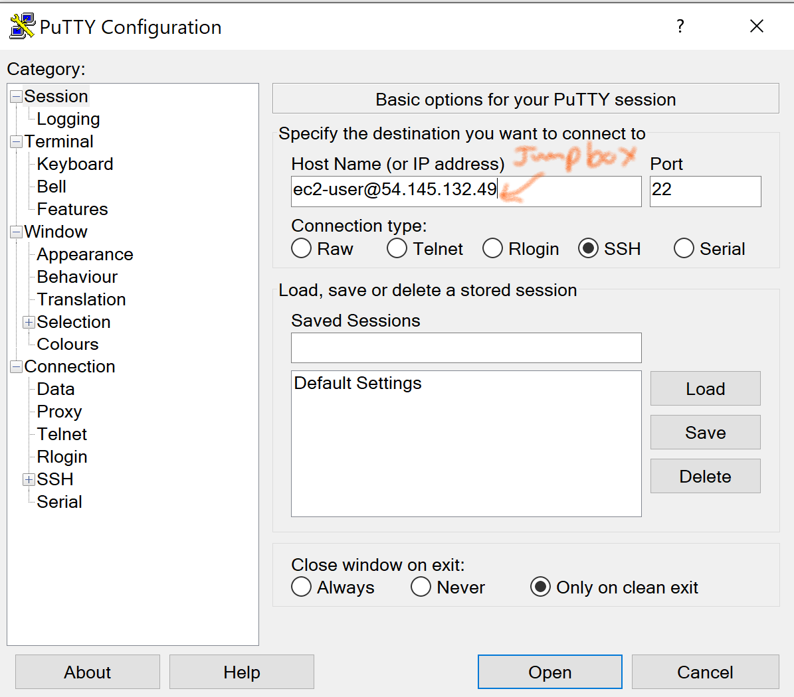
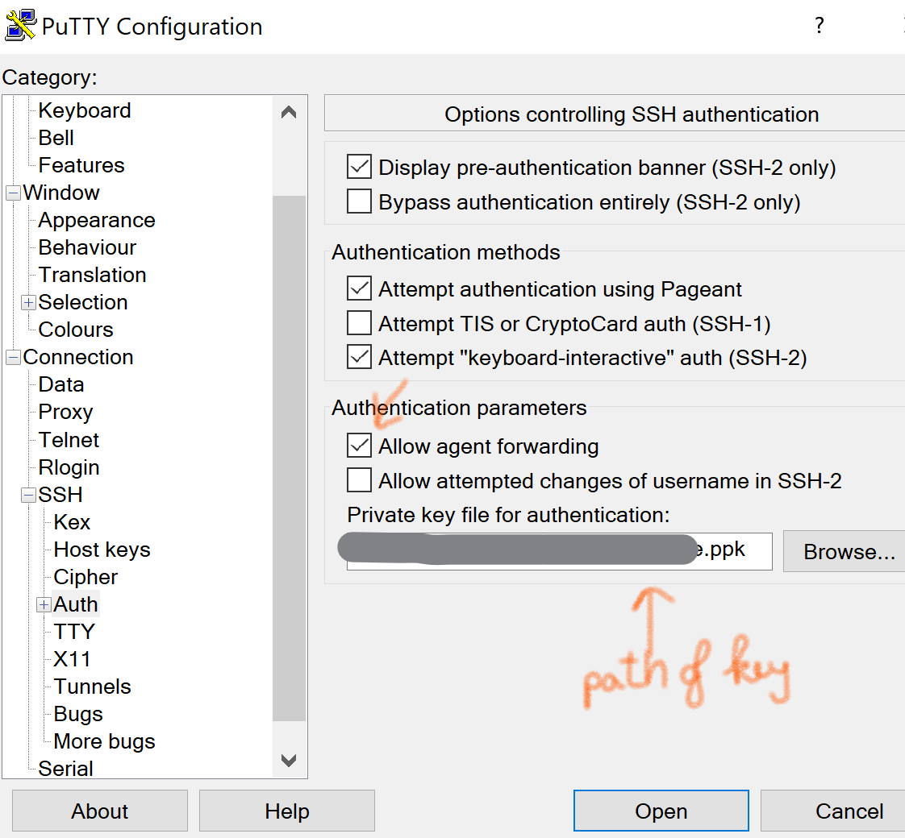
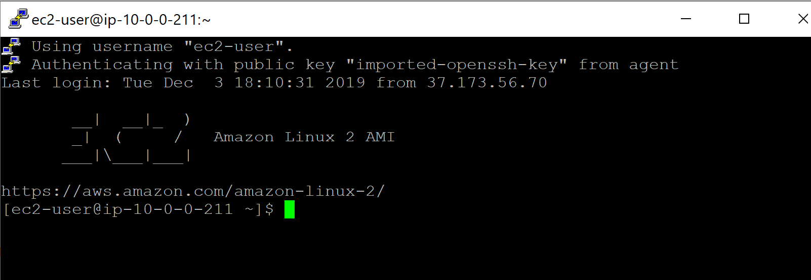
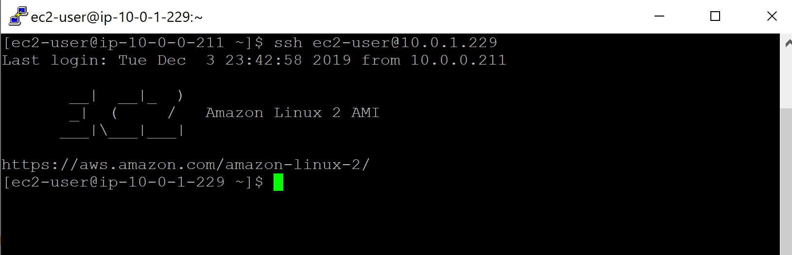
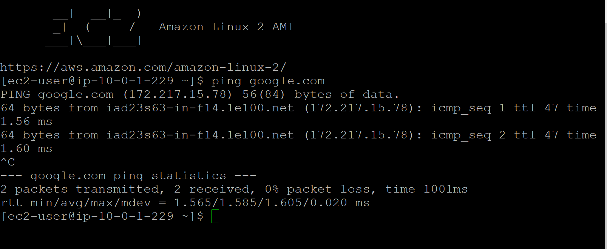

# aWS_NAT_instance
Connecting to an EC2 in a private subnet and pinging around internet from this instance (no use of VPN)

## Aim of the tutorial
	
 One wants to create an instance EC2 in an private subnet, called E1, which can be accessed only by another instance, called E2, in a public subnet of the same VPC. This tutorial aims at pinging internet from E1 with help of a NAT instance that is located in the public subnet and plays a role as an outbound/inbound bridge of E1 with the internet. To this end, we need to:
  - Create a VPC
  - Create 2 subnets : one is public (S1), one is private (S2) 
  - Create 3 instances : jump_box (E1), NAT_instance located in S1 and final_instance (E2) located in S2
  - Implement two route tables: one connected to the internet gateway (for public subnet), one connected to the NAT instance (for private subnet)
  - Define security groups corresponding to 3 instances 
## Step 1: Configuration of subnets and EC2 Instances

- For subnets:
	- "Public_Jump_box" subnet is associated with the Route table "Costume for Public"
	- "Private_Final_instance" subnet is associated with the Route table "Main for private"
	- The Route tables are defined as follows:
	
     

- For Instances: 
	- Create "Jumpbox_instance" and "NAT_instance" associated with the public subnet. The INBOUND security groups are set to SSH for the jumpbox (ssh) and ICMP for NAT instance (ping). 
	- Remarks : 
		- NAT instance has a specific AMI 
		
     
		
				
		- The Source/Dest of NAT instance must be disable
				
     
			
## Step 2: SSHing to the jumpbox using client PUTTY

- We have to convert the key .pem to .ppk using PUTTYGen

- To hop to the Final instance, we use Pageant to enable SSH agent forwarding: launch Pageant -> Add key
	

- Launch PUTTY : check box "Allow agent forwarding"

		
	
	
...Access to jumpbox:
	
	
...Hopping to Final instance with command line : ssh ec2-user@(private only) IP of Final instance
	
	

## Step 3 : Let's ping google.com

	
	
		
